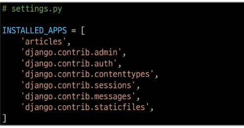

# Django

## Django and Framework

### Framework

- 웹 서비스 개발에는 무엇이 필요할까?
- 잘 만들어진것을 잘 활용하는것이 능력인 시대


1. Framework : 웹 애플리케이션을 빠르게 개발할 수 있도록 도와주는 도구 </br> (개발에 필요한 기본 구조, 규칙, 라이브러리 등 제공)
   
2. Framework를 사용하는 이유 : 
    - 기본구조, 도구, 규칙을 제공하기 때문에 필수적인 핵심개발에만 집중 가능
    - 여러 라이브러리 제공해 개발속도를 빠르게 할 수 있음
    - 유지보수와 확장에 용이해 소프트웨어의 품질을 높임
  

### Django frame work

### 클라이언트와 서버

### Django 프로젝트 및 가상환경

## Django Design Pattern

### Django 프로젝트와 앱

### Django 디자인 패턴

### 요청과 응답

# 강사님 강의
다른곳에서 가져올때 pip install -r requirements.txt 로 가져올것
1. 프로젝트생성
2. 앱생성


</br>
</br>

## *장고 실행시키는법*
```
1. 가상환경 venv 생성
   - python -m venv venv
   (venv 폴더가 생김)
2. 가상환경 활성화
   - source venv/scripts/activate
   ((venv)가 붙으면서 가상환경이 활성화됨)
3. Django 설치
   - pip install Django
   (장고 설치됨)
4. 환경에 설치된 패키지 목록 확인
   - pip list
    패키지의 리스트와 버전을 확인가능
5. 의존성 패키지 목록 생성
   - pip freeze > requirements.txt
   - 프로젝트 개발할 때 설치된 모든 패키지들의 종류와 버전을 명시하는 파일
   (없으면 버전 업데이트되어서 안돌아가게됨)
```
## *장고 프로젝트 생성*
```
1. 장고 프로젝트 생성
    - django-admin startproject firstpjt .
    (firstpjt) 라는 이름의 프로젝트가 생성됨
2. django 서버 실행하기
    - python manage.py runserver
    (이러면 서버 실행됨 그런데 이제 아무것도 없는)
```

## *장고 프로젝트와 앱*

### 장고 프로젝트란?
    - 애플리케이션의 집합
    (DB설정, URL연결, 전체 앱 설정 등을 처리)
### 장고 어플리케이션
    - 독립적으로 작동하는 기능 단위 모듈
    (각자 특정한 기능을 담당하며 다른 앱들과 함께 하나의 프로젝트를 구성)
### 앱 사용 과정
1. 앱 생성
   - python manage.py startapp articles
   - startapp 뒤에 앱 이름 (복수형으로 만들기)
2. 앱 등록
   - 반드시 앱 생성한 후에 등록해야함
   - 앱을 생성하면 프로젝트에 꼭 등록하기
   - firstpjt 폴더안의 setting.py에 추가

    

## 장고 디자인 패턴

### MVC디자인 패턴

*Model View Controller*
서비스 분리되어 존재하고 관리됨</br>
애플리케이션을 구조화하는 대표적인 패턴</br>
(데이터, 사용자 인터페이스, 비즈니스 로직을 분리)</br>
분리되어있지만 유기적으로 하나의 응답을 함.
**장고에서는 MTV라고 명칭함**
Mode = database
View = 사용자에게 보여지는 부분
Controller = 사용자의 요청을 처리하는 로직
### MTV

1. M : Model -> model.py
2. T : Template -> templates.py -> 보여지는 것(화면)
3. V : View -> views.py -> 중계자 - 중간처리 역할(Model과 Template와 관련된 로직(예 : 함수))
4. pdf78페이지 중요
 ---
admin.py = 관리자용 페이지
models.py = db관련 model정의(mtv의 m)
views.py = http요청을 처리하고 해당요청에 대한 응답 반환(mtv의 v)
templates.py 폴더 직접 생성(mtv 의 t)
apps.py = 앱의 정보가 작성된 곳
test.py = 프로젝트 테스트 코드를 작성하는곳

요청 1. -> urls.py 받으면 views.py(함수) 호출 만약 db에 필요한값이 있으면 가져옴 templates에 있으면 가져옴(생으로 가져오면 사용자가 보기 어려움 따라서 보기 쉽게하려고 templates에 data넣어서 응답.)

url 경로는 반드시 '/' 로 끝나야함. '/' 있는거랑 없는거랑 다름

views.py에서 template을 인식 못할떄
1. templates 스펠링 체크
2. 서버 껐다 켠다.
3. setting.py installed_app등록 했는지


action & method
데이터를 어디(action)로 어떤 방식(method)으로 요청할지

'input' element : 사용자의 데이터를입력 받을 수 있는 요소 (type 속성 값에 따라 다양한 유형의 입력 데이터를 받음)

'name' attribute -> input의 핵심 속성 : 서버로 보내는 키 (입력한 데이터에 붙이는 이름)

## form 데이터를 가져오는 방법
 - request.GET.get('message')

## variable Routing
- url의 일부에 변수를 포함시키는 것