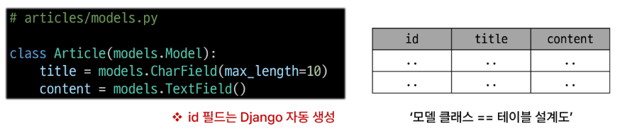
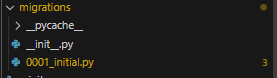

# Djanago Model

## Model
- DB테이블을 정의하고 데이터를 조작할 수 있는 기능들을 제공
- 모델 클래스는 테이블 설계도
  - 작성한 모델 클래스는 최종적으로 DB에 다음과 같은 테이블 구조를 만듬
    
- model 클래스의 키워드 인자( 필드 옵션)
- 테이블 필드의 제약조건 관련 설정
- 클래스 변수명 : 테이블의 각 '필드'이름
- model Field 클래스 :  model 필드의 "데이터 타입"
- 
### Migrations
  - 전까지는 설계만 한 것
  - model class 의 변경점을 DB에 최종 반영하는 방법
  - 반드시 model class -> migration -> db.dqlite3  순서대로 가야함.
  - 모델 클래스에 변경사항이 생겼다면 반드시 새로운 설계도를 생성하고 이를 DB에 반영해야한다.
  - 설계도를 이해하지 못하기 때문에 makemigrations 해야함.
  
  ***핵심 명령어 2가지***
  1. python manage.py makemigrations (model class를 기반으로 최종설계도 작성)
     - 초안을 바탕으로 장고가 최종 설계도를  만들어 준것
     - 
  2. python manage.py migrate(최종 설계도를 DB에 전달하여 반영)

sqlite에서 opendatabase해야함.

- CharField(max_length = ) 
  - 길이의 제한이 있는 문자열을 넣을 때 사용 (필드의 최대 길이를 결정하는 max_length 필수로 가져야함)
- TextField()
  - 글자의 수가 많을 때 사용
- DateTimeField
  - 1. auto_now = 데이터가 저장될 때마다 자동으로 현재 날짜시간을 저장(수정일)
  - 2. auto_now_add = 데이터가 처음 생성될 때만 자동으로 현재 날짜시간을 저장(작성일)

아직은 view함수를 통해서 데이터에 글을 쓸 수 있는 코드는 못 작성함
장고에는 관리자 사이트가 있어용
관리자 사이트는 프로젝트 전체에 대한 최고 권한을 가지고있는 유저에용
회원을 강제 탈퇴 시킬 수 있는ㅋㅋ

## Automatic admin interface

장고는 추가 설치 및 성정 없이 자동으로 관리자 인터페이스를 제공함
엄청난 장점이에요
 