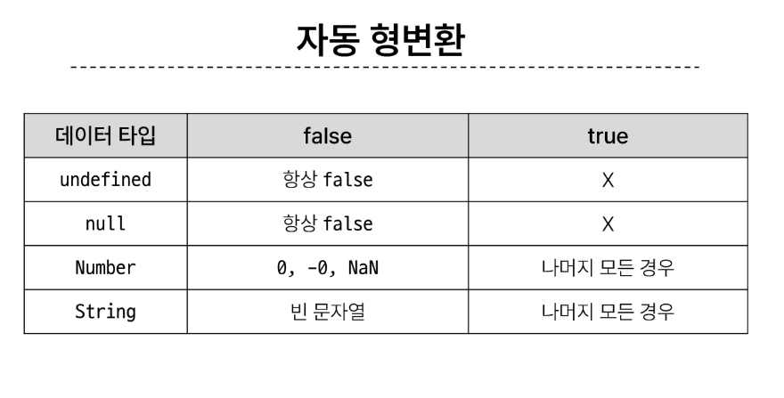
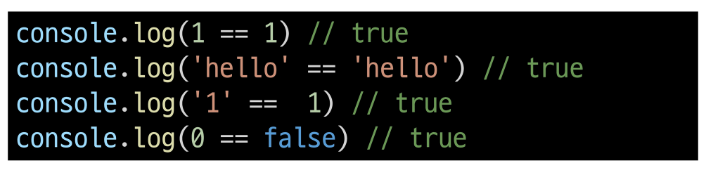
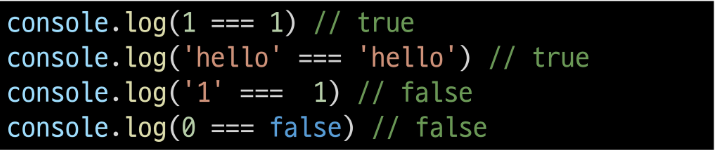
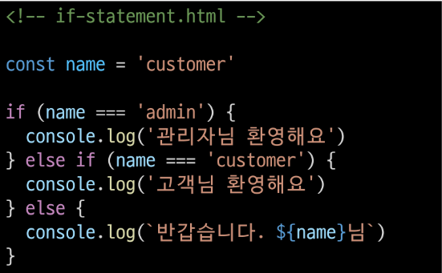
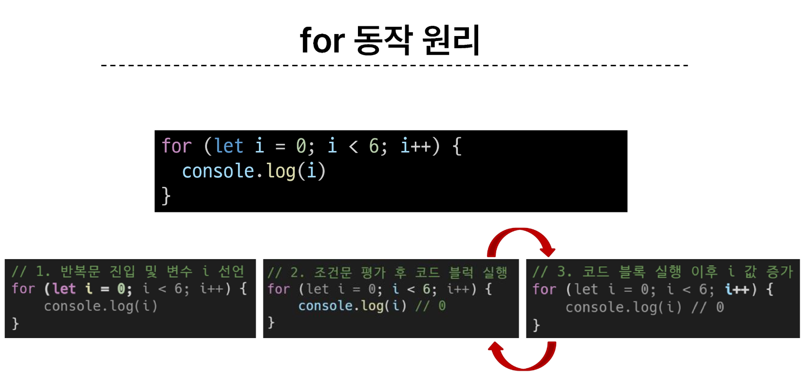
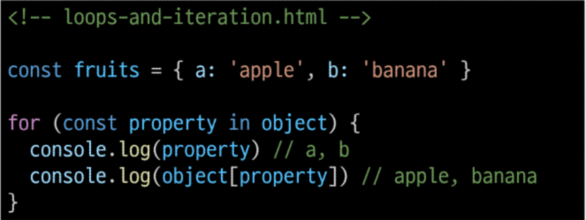
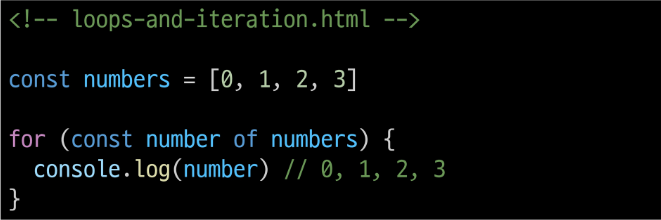
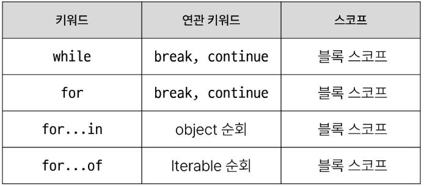

# 1024_JS

## 식별자(변수명) 작성 규칙

- 반드시 문자, 달러 또는 밑줄(_)로 시작
- 대소문자 구분
- 예약어 사용 불가 
  - (for, if, function등)
- 카멜케이스(camelCase)
  - 변수, 객체, 함수에 사용
- 파스칼 케이스 (PascalCase)
  - 클래스 생성자에 사용
- 대문자 스네이크 케이스(SNAKE_CASE)
  - 상수에 사용

## 변수 선언 키워드

1. let
- 블록 스코프(중괄호) 를 갖는 지역 변수를 선언
- 재할당 가능
- 재선언 불가능
- ES6에서 추가
2. const
- 블록 스코프를 갖는 지역 변수를 선언
- 재할당 불가능
- 재선언 불가능
- ES6에서 추가
3. var

### 변수 선언 키워드 정리
- 기본적으로 const 사용 권장
- 재할당이 필요한 변수는 let으로 변경해서 사용

## 데이터 타입

### 원시 자료형 vs 참조 자료형

### 원시 자료형
- Number, String, Boolean, undefined, null
- 변수에 값이 직접 저장되는 자료형(불변, 값이 복사)
#### String 예시
- '+'연산자를 사용해 문자열끼리 결합
- 곱셈, 나눗셈, 뺄셈 불가능
- Template literals(템플릿 리터럴)(f스트링이랑 같은 역할)
  - 내장된 표현식을 허용하는 문자열 작성 방식
  - Backtick(``)을 이용, 여러줄에 걸쳐 정의가능 JS의 변수를 문알 안에 바로 연결 가능
  - 표현식은 '\$'와 중괄호(${expression})로 표기

#### null과 undefined
1. null = 변수의 값이 없음을 의도적으로 표현할 때 사용
2. undefined = 변수 선언 이후 직접 값을 할당하지 않으면 자동으로 할당됨
- 값이 없음이 2개인 이유는 설계 실수니까 그냥 그런갑다 하세용
  
#### Boolean
- 자동 형변환

## 연산자

### 할당 연산자
- 오른쪽에 있는 피연산자의 평가 결과를 왼쪽 피연산자에 할당하는 연산자
- 단축 연산자 지원

### 증가 & 감소 연산자

#### 증가 연산자(++)
  - 피연산자를 증가(1 더함) 시키고 연산자의 위치에 따라 증가하기 전이나 후의 값을 반환
  
#### 감소연산자(--)
  - 피연산자를 감소(1 뺌) 시키고 연산자의 위치에 따라 감소하기 전이나 후의 값을 반환

- += 또는 -= 과 같이 더 명시적인 표현 권장

### 동등 연산자(==)
  - 두 피 연산자가 같은 값으로 평가되는 지 비교 후 boolean 값을 반환
  
  - 잘 안씀
  
### 일치연산자(===)
- 두 피연산자의 값과 타입이 모두 같은 경우 true 반환
- 특수한 경우를 제외하면 일치 연산자 사용 권장

### 논리연산자
- and 연산 (&&)
- or 연산 (||)
- not 연산 (!)
- 단축 평가 지원

## 조건문

### if 
  

### 조건(삼항) 연산자
- 세개의 피연산자를 받는 유일한 연산자
- 앞에서부터 조건문, 물음표(?), 조건문이 참을경우 실행할 표현식, 콜론(:), 조건문이 거짓일 경우 실행할 표현식 배치

## 반복문
- while, for, for...in, for...of
  
### while
- 파이썬과 유사

### for 
- 특정한 조건이 거짓으로 판별될 때까지 반복
- 파이썬 for문과 다름

### for...in
- 객체의 열거 가능한 속성(property)에 대해 반복
  

### for...of
- 반복 가능한 객체(배열, 문자열 등)에 대해 반복
- 

### 배열 반복과 for...in
- 배열의 인덱스는 정수 이름을 가진 열거 가능한 속성
- for...in 은 정수가 아닌 이름과 속성을 포함하여 열거 가능한 모든 속성을 반환
- 내부적으로 for...in 은 배열의 반복자 대신 속성 열거를 사용하기 때문에 특정 순서에 따라 인덱스를 반환하는 것을 보장할 수 없음
- 인덱스의 순서가 중요한 배열에서는 사용 X
- **for...in 은 객체(오브젝트)에서만 씀. 나머지는 for...of**

### 반복문 사용시 const 사용 여부

#### for문
- for의 경우에는 최초 정의한 i 를 재할당하면서  사용 const를 사용하면 에러 발생 
#### for...in, for...of
- 재할당이 아니라, 매 반복마다 다른 속성 이름이 변수에 지정되는 것이므로  const를 사용해도 에러가 발생하지않음 
- 단 const 특징에 따라 블록 내부에서 변수 수정 불가

### 반복문 종합

