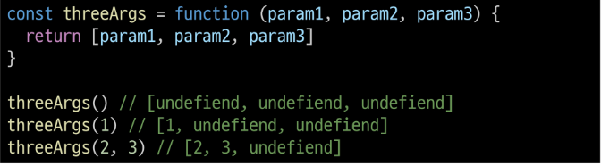
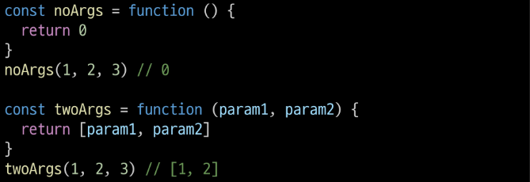
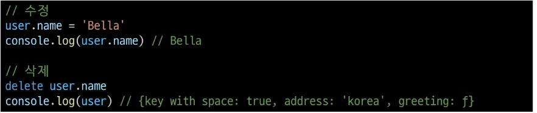

# 1025_JS

## 함수구조

## 함수 정의 2가지 방법
1. 선언식
   
  

2. 표현식
   
  

### 표현식 특징
- 함수 이름이 없는 익명 함수를 사용 가능
- 선언식과 달리 표현식으로 정의한 함수는 호이스팅 되지 않으므로 함수를 정의하기 전에 먼저 사용할 수 없음
- 사용 권장됨

### 매개변수 정의방법
1. 기본함수 매개변수
  - 값이 없거나 undifined가 전달될 경우 이름 붙은 매개변수를 기본값으로 초기화

2. 나머지 매개변수
   - 임의의 수의 인자를'배열'로 허용하여 가변인자를 나타내는 방법

### 매개변수와 인자의 개수 불일치
1. 매개변수 개수 > 인자 개수
   - 누락된 인자는 undefined로 할당
  
     
1. 매개변수 개수 < 인자 개수
   - 초과 입력한 인자는 사용하지 않음
  
      

### 전개 구문
spread syntax -> '...'
- 배열이나 문자열과 같이 반복 가능한 항목을 펼치는 것
- 전개 대상에 따라 역할이 다름
  
1. 함수와의 사용
   1. 함수 호출 시 인자 확장
   2. 나머지 매배면수 (압축)
2. 객체와의 사용
3. 배열과의 활용

#### 전개구문 활용
- 함수와의 사용
  1. 함수 호출 시 인자 확장
  2. 나머지 매개변수(압축)

### 화살표 함수 표현식

## 객체(object)
- 키로 구분된 데이터 집합을 저장하는 자료형

### 객체 구조

- 중괄호를 이용해 작성
- 중괄호 안에는 key:Value쌍으로 구성된 속성(property)를 여러 개 작성가능
- key는 문자형만 허용
- value는 모든 자료형 허용

### 속성 참조

- 점('.', chaining operator)또는 대괄호로 객체 요소 접근
- ket 이름에 띄어쓰기 등 같은 구분자가 있으면 대괄호 접근만 가능

- 조회 & 추가
  

- 수정 & 삭제
   

#### in 연산자
- 속성이 객체에 존재하는지 여부를 확인

## Method
- 객체 속성에 정의된 함수

### Method 사용 예시
- object.method()방식으로 호출
- 매서드는 객체를 '행동'으로 할 수 있게 함

## 배열

### 배열구조

- 대괄호를 이용해 작성
- 배열 요소 자료형 : 제약 없음
- length 속성을 사용해 배열에 담긴 요소가 몇 개인지 알 수 있음

### 주요 메서드
1. push/pop
   - pop : 배열 끝 요소를 제거하고, 제거한 요소 반환
   - push : 배열 끝에 요소 추가
  
2. unshift/shift
   - shift : 배열 앞 요소 제거, 제거한 요소 반환
   - unshift : 배열 앞에 요소 추가

### Array Helper Methods
- 배열을 순회하며 특정 로직을 수행하는 메서드
- -> 메서드 호출 시 인자로 함수(콜백함수)를 받는 것이 특징

#### 주요 Array Helper Methods
1. forEach
- 인자로 주어진 함수(콜백함수)를 배열 요소 각각에 대해 실행
-  콜백함수는 3가지 매개변수로 구성
  1) item : 처리할 배열의 요소
  2) index : 처리할 배열 요소의 인덱스(선택인자)
  3) array : forEach를 호출할 배열(선택인자)
- 반환값 : undefined
  <!-- img넣기 -->
1. map
- 배열 내의 모든 요소 각각에 대해 함수(콜백함수)를 호출하고, 함수 호출 결과를 모아 새로운 배열을 반환