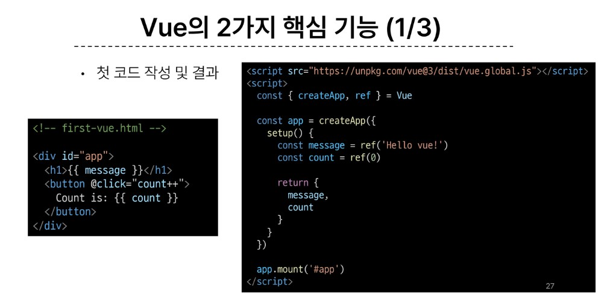

# Vue!

# Front-end Development

- 웹사이트와 웹 애플리케이션의 사용자 인터페이스와 사용자 경험을 만들고 디자인하는것

## client-side frameworks

- 클라이언트 측에서 UI와 상호작용을 개발하기 위해 사용되는 JavaScript 기반 프레임워크
- 대표적으로 앵글러, 뷰, 리액트 

### 왜 필요?

1. 웹에서 하는 일이 많아졌다.
   - 단순히 무언가를 읽는 곳 -> 하는 곳
   - 현대적이고 복잡한 대화형 웹 사이트를 "웹 애플리케이션" 이라 부름
   - 동적인 대화형 애플리케이션을 훨씬 더 쉽게 구축할 수 있게 됨
2. 웹에서 하는 일이 많아졌다.
   - 다루는 데이터가 많아졌다.
   - 애플리케이션의 상태를 변경할 때마다 일치하도록 UI를 업데이트 해야 한다는것

## SPA(Single Page Application)
- 페이지 한 개로 구성된 웹 애플리케이션

1. 서버로부터 필요한 모든 정적 HTML을 처음에 한 번 가져옴
2. 브라우저가 페이지를 로드하면 Vue 프레임워크는 각 HTML 요소에 적절한 JavaScript 코드를 실행(이벤트에 응답, 데이터 요청 후 UI업데이트 등)
   - 페이지간 이동시, 페이지 갱신에 필요한 데이터만을 JSON으로 전달받아 페이지 일부 갱신
   - Google Maps, 인스타그램 등의 서비스에서 갱신 시 새로고침이 없는 이유

- 웹 애플리케이션의 초기 로딩 후 새로운 페이지 요청 없이 동적으로 화면을 갱신하며 사용자와 상호작용하는 웹 애플리케이션
- **CSR 방식**
  
## SCR(Client-side Rendering)
- 클라이언트에서 화면을 렌더링 하는 방식
- 반대개념 : SSR
1. 브라우저는 페이지에 필요한 최소한의 HTML 페이지와 JavaScript를 다운로드
2. 그런다음 JavaScript를 사용하여 DOM을 업데이트하고 페이지를 렌더링

### CSR의 장점
1. 빠른 속도
   - 페이지의 일부를 렌더링 할 수 있으므로 동일한 웹 사이트의 다른 페이지로 이동하는 것이 일반적으로 더 빠름(일부만 다시 그리면 되니까)
   - 서버로 전송되는 데이터의 양을 최소화
2. 사용자 경험
   - 새로고침이 발생하지 않아 네이티브 앱과 유사한 사용자 경험을 제공
3. Front-end와 Back-end의 명확한 분리
   - Front-end는 UI 렌더링 및 사용자 상호 작용 처리를 담당 & Back-end는 데이터 및 API 제공을 담당
   - 대규모 애플리케이션을 더 쉽게 개발하고 유지 관리 가능

### CSR의 단점
1. 초기 구동속도가 느림
   - 전체 페이지를 보기 전에 약간의 지연을 느낄 수 있음
   - JavaScript가 다운로드, 구문 분석 및 실행될 때까지 페이지가 완전히 렌더링 되지 않기 때문
2. SEO(검색 엔진 최적화)문제
   - 페이지를 나중에 그려나가는 것이기 때문에 검색에 잘 노출되지 않을 수 있음

## what is Vue?

- 사용자 인터페이스를 구축하기 위한 JavaScript  
  
### Vue 를 학습하는 이유?
1. 쉬운 학습 곡선 및 간편한 문법
   - 새로운 개발자들도 빠르게 학습 가능
2. 반응성 시스템
   - 데이터 변경에 따라 자동으로 화면이 업데이트되는 기능 제공
3. 모듈화 및 유연한 구조
   - 애플리케이션을 컴포넌트 조각으로 나눌 수 있음
   - 코드의 재사용성을 높이고 유지보수를 용이하게 함

### Vue의 2가지 핵심 기능
1. 첫 코드 작성 및 결과
   - 
   - 
   (1) 선언적 렌더링
     -  HTML을 확장하는 템플릿 구문을 사용하여 HTML이 JavaScript 데이터를 기반으로 어떻게 보이는지 설명할 수 있음
   (2) 반응형
     - JavaScript상태 변경사항을 자동으로 추적하고 변경사항이 발생할 때 DOM을 효율적으로 업데이트

### Vue를 사용하는 방법
1. 'CDN' 방식
2. 'NPM'설치 방식
   - *CDN 방식 이후 진행*

### 첫번째 Vue 작성하기
- CDN 및 Application instance 작성
  
  
- Application instance
  - 모든 Vue 애플리케이션은 createApp함수로 새 Application instance를 생성하는 것으로 시작
  
  
- app.mount()
  - 컨테이너 요소에 애플리케이션 인스턴스를 탑재(연결)
  - 각 앱 인스턴스에 대해 mount()는 한번만 호출할 수 있음
  
  

### ref()
- 반응형 상태(데이터)를 선언하는 함수

### ref함수
   1. 
   2. 

### Vue 기본 구조
- createApp()에 전달되는 객체는 Vue 컴포넌트(Component)
- 컴포넌트의 상태는 setup()함수 내에서 선언되어야 하며 객체를 반환해야 함

### 템플릿 렌더링
1. 
2. 