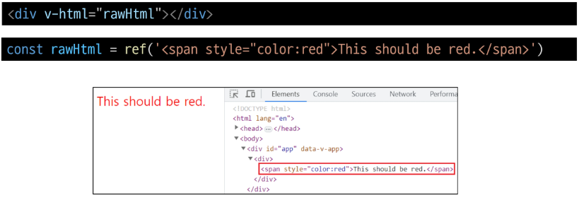
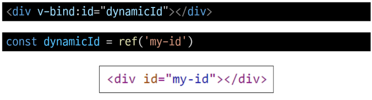
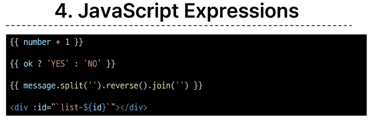
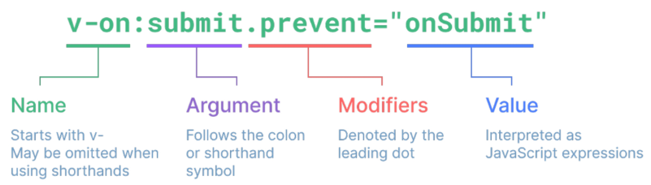
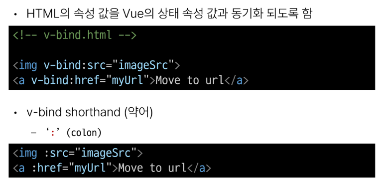
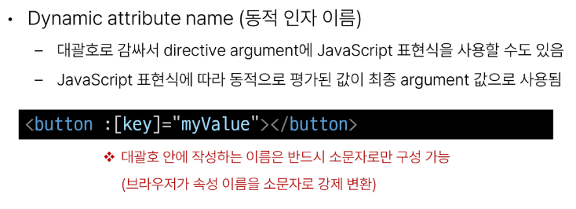
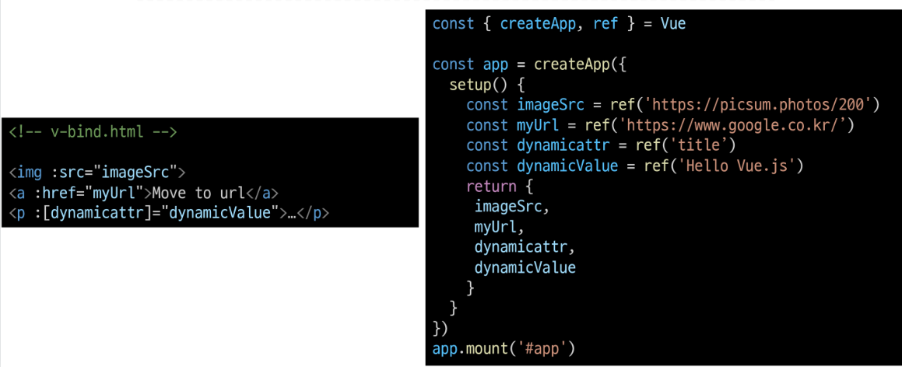
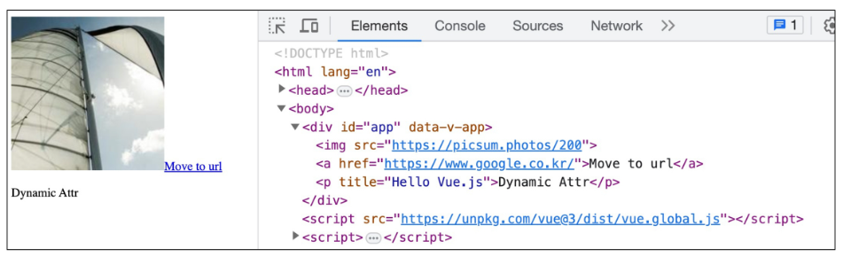

# 1102_BasicSyntax

## Template Syntax
- DOM을 기본 구성 요소 인스턴스의 데이터에 선언적으로 바인딩할 수 있는 HTML 기반 템플릿 구문을 사용

### Template Syntax의 종류
1. Text Interpolation
2. Raw HTML
3. Attribute Bindings
4. JavaScript Expressions

### Text Interpolation

- 데이터 바인딩의 가장 기본적인 형태
- 이중 중괄호 구문(콧수염 구문)을 사용
- 콧수염 구문은 해당 구성요소 인스턴스의 msg 속성 값으로 대체
- msg 속성이 변결될 때마다 업데이트 됨.

### Raw HTML

- 콧수염 구문은 데이터를 일반 텍스트로 해석하기 때문에 실제 HTML을 출력하려면 v-html을 사용해야 함

### Attribute Bindings

- 콧수염 구문은 HTML 속성 내에서 사용할 수 없기 때문에 v-bind를 사용
- HTML의 id 속성 값을 vue 의 dynamicId 속성과 동기화 되도록 함
- 바인딩 값이 null이나 undefind인 경우 렌더링 요소에게 제거됨

### JavaScript Expessions

- Vue는 모든 데이터 바인딩 내에서 JavaScript 표현식의 모든 기능을 지원
- Vue 템플릿에서 JavaScript 표현식을 사용할 수 있는 위치
  - 콧수염 구문 내부
  - 모든 directive의 속성 값(v-로 시작하는 특수 속성)

#### Expressions 주의사항
- 각 바인딩에는 하나의 단일 표현식만 포함될 수 있음
  - 표현식은 값으로 평가할 수 잇는 코드 조각(return 뒤에서 사용할 수 있는 코드여야 함)
- 작동하지 않는 경우

## Directive
- 'v-' 접두가사 있는 특수 속성
- 속성 값은 단일 JavaScript 표현식이어야함(-v for, -v on 제외)
- 표현식 값이 변경될 때 DOM에 반응적으로 업데이트를 적용
- 예시
  - v-if 는 seen 표현식 값의 T/F를 기반으로 \
 요소를 제거/삽입
    
- 전체 구문
  

## Dynamically data binding

### v-bind
- 하나 이상의 속성 또는 컴포넌트 데이터를 표현식에 동적으로 바인딩

### v-bind 사용처
1. Attribute Bindings
2. Class and Style Bindings
   
### Attribute Bindings

### Attribute Bindings 예시

### Class and Style Bindings
- 클래스와 스타일은 모두 속성 v-bind를 사용하여 다른 속성과 마찬가지로 동적으로 문자열 값을 할당 가능
- but, 단순히 문자열 연결을 사용하여 이러한 값을 생성하는 것은 번거롭고 오류가 발생하기 쉬움
- Vue는 클래스 및 스타일과 함께 v-bind를 사용할 때 객체 또는 배열을 활용한 개선 사항을 제공

## Event Handilng
- v-on 
  - DOM 요소에 이벤트 리스너를 연결 및 수신
