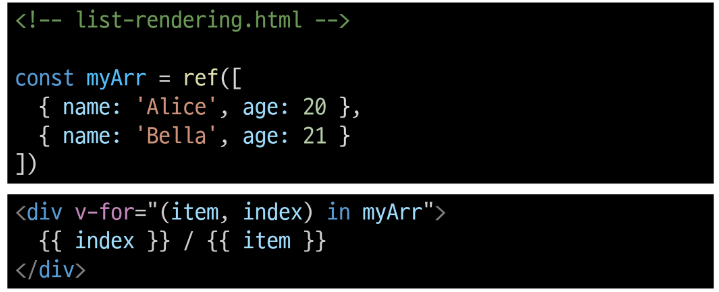

# 1106 Vue Basic Syntax-02

## Computed Properties

### computed()
- 계산된 속성을 정의하는 함수
- 미리 계산된 속성을 사용하여 템플릿에서 표현식을 단순하게 하고 불필요한 반복 연산을 줄임

### computed 기본 예시

### computed 특징
- 반환되는 값은 computed ref이며 일반 refs와 유사하게 계산된 결과를 .value로 참조할 수 있음(템플릿에서는 .value 생략 가능)
- computer 속성은 의존된 반응형 데이터를 자동으로 추적
- 의존하는 데이터가 변경될 때만 재평가
  - restOfTodos의 계산은 todos에 의존하고 있음
  - 따라서 todos가 변경될 때만 restOfTodos가 업데이트 됨

### computed와 동일한 로직을 처리할 수 있는 method
- computed 속성 대신 method로도 동일한 기능을 정의할 수 있음
- 두가지 접근 방식은 실제로 완전히 동일
- 

### computed 와 method 차이
- computed 속성은 의존된 반응형 데이터를 기반으로 캐시(cached) 된다
- 의존하는 데이터가 변경된 경우에만 재평가됨
- 즉, 의존된 반응형 데이터가 변경되지 않는 한 이미 계산된 결과에 대한 여러 참조는 다시 평가할 필요 없이 이전에 계산된 결과를 즉시 반환
- **반면 method 호출은 다시 렌더링이 발생할 때마다 항상 함수를 실행**

### Cache(캐시)
- 데이터나 결과를 일시적으로 저장해두는 임시 저장소
- 이후에 같은 데이터나 결과를 다시 계산하지 않고 빠르게 접근할 수 있도록 함

### method 와 computed 정리
1. computed
   - 의존된 데이터가 변경되면 자동으로 업데이트
2. method
   - 호출해야만 실행 됨

- **무조건 computed만 사용하는것이 아니라 사용 목적과 상황에 맞게 computed 와 method를 적절히 조합하여 사용**

## Conditional Rendering

### v-if
- 표현식 값의 T/F를 기반으로 요소를 조건부로 렌더링
- v-if 는 directive이기 때문에 단일 요소에만 연결 가능
- 이 경우 template요소에 v-if 를 사용하여 하나 이상의 요소에 대해 적용할 수 있음(v-else, v-else-if 모두 적용 가능)
  - ***HTML\<temlplate> element***
    - 페이지가 로드 될 때 렌더링 되지 않지만 JavaScript를 사용하여 나중에 문서에서 사용할 수 있도록 하는 HTML을 보유하기 위한 매커니즘
    - 보이지않는 wrapper역할

### v-show
- 표현식 값의 T/F를 기반으로 요소의 가시성을 전환
- v-show 요소는 한상 렌더링 되어 DOM에 남아있음
- CSS display 속성만 전환하기 때문

### v-if vs v-show
- v-if 
  - 초기 조건이 false인 경우 아무 작업도 수행하지 않음
  - 토글 비용이 높음
- v-show
  - 초기 조건에 관계 없이 항상 렌더링
  - 초기 렌더링 비용이 더 높음

- 무언가를 매우 자주 전환해야 하는 경우에는 v-show, 실행 중에 조건이 변경되지 않는 경우에는 v-if를 권장

## List Rendering

### v-for
- 소스 데이터를 기반으로 요소 또는 템플릿 블록을 여러번 렌더링
- v-for은 alias in experssion 형식의 특수 구문을 사용하여 반복되는 현재 요소에 대한 별칭 제공
- 인덱스(객체에서는 키)에 대한 별칭을 지정할 수 있음

### v-for 예시

1. 배열반복

2. 객체 반복

### 동일 요소에 v-for과 v-if 사용하지않음
- 동일 요소에서 v-if 가 v-for 보다 우선순위가 더 높기 때문
- **v-if 조건은 v-for 범위의 변수에 접근할 수 없음**

## watch()
- 반응형 데이터를 감시하고, 감시하는 데이터가 변경되면 콜백 함수를 호출

### watch 구조

### Computed와 Watchers

## Lifecycle Hooks
- vue 인스턴스의 생애주기 동안 특정 시점에 실행되는 함수
- **개발자가 특정 단계에서 의도하는 로직이 실행될 수 있도록 함**

### 특징
- vue는 Lifecycle Hooks에 등록된 콜백 함수들을 인스턴스와 자동으로 연결함
- 이렇게 동작하려면 hooks 함수들은 반드시 동기적으로 작성되어야 함
- 인스턴스의 생애 주기의 여러 단계에서 호출되는 다른 hooks도 있으며, 가장 일반적으로 사용되는 것은 **onMounted, onUpdated, onUnmounted**